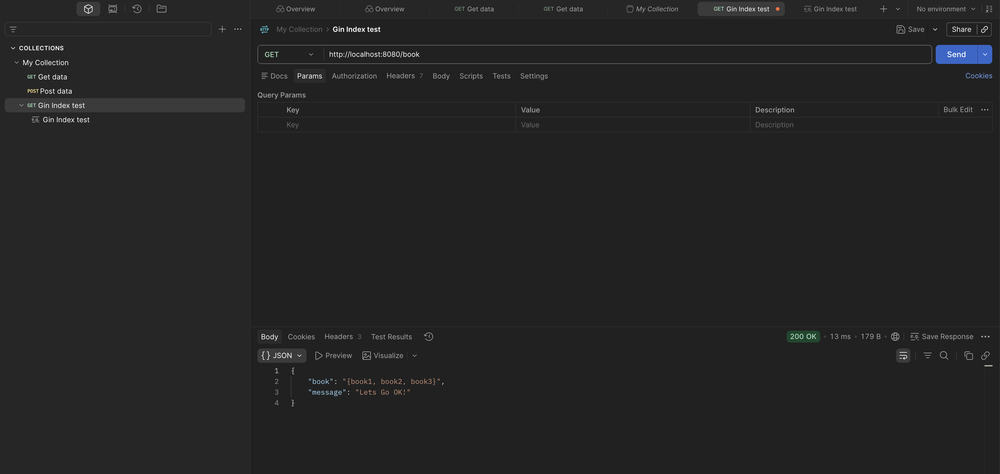

# Tutorial 2023! 
>Penamaan file dan folder bukan patokan

# Gin Gonic Web Framework - 1 [Bahasa Indonesia]
```
source : https://youtu.be/Mx5fdAlZSwI?si=nAtBBG9d3Eowpipu
```
---

## PENDAHULUAN
#### *inisialisasi GO MOD*
```
go mod init <github.com/Yuseonr/gin-labs> atau bisa <gin-labs>
```
#### *instalasi gin-gonic*
```
go get -u github.com/gin-gonic-gin
```

## Membuat simple endpoint
```Go
package main

import "github.com/gin-gonic/gin"

func main (){
	app := gin.Default()
	route := app
	route.GET("/", func(ctx *gin.Context) {
		ctx.JSON(200, gin.H{"message" : "Lets Go OK!"})

        // Dibawah sini biasanya diberi return
        // return

        // return biasa digunakan untuk membuat if statement dapat memberhentikan kode,
        // agar misal suatu kondisi tertentu tercapai, kirim X dan jangan lanjutkan dibawahnya.

	})

    app.Run(":8080")
}
```

```
go run main.go
[GIN-debug] [WARNING] Creating an Engine instance with the Logger and Recovery middleware already attached.

[GIN-debug] [WARNING] Running in "debug" mode. Switch to "release" mode in production.
 - using env:   export GIN_MODE=release
 - using code:  gin.SetMode(gin.ReleaseMode)

[GIN-debug] GET    /                         --> main.main.func1 (3 handlers)
[GIN-debug] [WARNING] You trusted all proxies, this is NOT safe. We recommend you to set a value.
Please check https://github.com/gin-gonic/gin/blob/master/docs/doc.md#dont-trust-all-proxies for details.
[GIN-debug] Environment variable PORT is undefined. Using port :8080 by default
[GIN-debug] Listening and serving HTTP on :8080
[GIN] 2026/06/23 - 08:01:55 | 200 | 171.291µs |             ::1 | GET      "/"
[GIN] 2026/06/23 - 08:01:56 | 404 |    791ns |             ::1 | GET      "/favicon.ico"
```

# Gin Gonic Web Framework - 2 [Bahasa Indonesia]
```
source : https://youtu.be/0rC9zfbRt78?si=VUNikrRy4_FGTVB9
```
---

## Bootstrap App
*Melakukan Abstraksi dan enkapsulasi serta pemisahan tanggung jawab, supaya app dapat lebih termaintain*
```
.
├── bootstrap
│   └── index.go
├── config
│   └── app_config
│       └── index.app_config.go
├── controller
│   ├── book_controller
│   │   └── index.book_controller.go
│   └── user_controller
│       └── index.user_controller.go
├── main.go
└── routes
    └── index.route.go
```
```
main        -> manggil bootstrap.
bootstrap   -> appnya yang dari init gin, manggil initroute, dan run di port yang diambil dari config.
app_config  -> nyimpan config app agar di satu tempat, kaya port
routes      -> inisialisasi semua ruting yang dibutuhkan, kaya GET /user atau GET/book terus dikasi function controller
controller  -> menyediakan function sesuai data nya, misal user_controller dan punya func GetAllUser() handle memberikan user
```

```Go
// sandbox/jd-gin-gonic/main.go
package main

import b "github.com/Yuseonr/gin-labs/sandbox/jd-gin-gonic/bootstrap"

func main (){
	b.BootstrapApp()
}
```


```Go
// sandbox/jd-gin-gonic/bootstrap/index.go
package bootstrap

import (
	"github.com/Yuseonr/gin-labs/sandbox/jd-gin-gonic/config/app_config"
	"github.com/Yuseonr/gin-labs/sandbox/jd-gin-gonic/routes"
	"github.com/gin-gonic/gin"
)

func BootstrapApp (){
	app := gin.Default()
	routes.InitRoute(app)
	app.Run(app_config.Port)
}
```

```Go
// sandbox/jd-gin-gonic/controller/user_controller/index.user_controller.go

package user_controller

import "github.com/gin-gonic/gin"

func GetALLUser(ctx *gin.Context) {

	isValidate := true

	if isValidate {
		ctx.JSON(200, gin.H{
			"message": "Lets Go OK!",
			"user": "{user1, user2, user3}",
		})

		return

	} else {
		ctx.JSON(400, gin.H{
			"message": "Not validated!",
		})
	}
}

```

```Go
// sandbox/jd-gin-gonic/routes/index.route.go

package routes

import (
	"github.com/Yuseonr/gin-labs/sandbox/jd-gin-gonic/controller/book_controller"
	"github.com/Yuseonr/gin-labs/sandbox/jd-gin-gonic/controller/user_controller"
	"github.com/gin-gonic/gin"
)

func InitRoute(app *gin.Engine) {
	route := app
	route.GET("/user",user_controller.GetALLUser)
	route.GET("/book", book_controller.GetAllBook)
}	

```

## POSTMAN
> Postman dapat digunakan untuk analisa endpoint



# Gin Gonic Web Framework - 3 [Bahasa Indonesia]
```
source : https://youtu.be/WNHfrC-lwoI?si=8CFqRYhJ0VGQy66o
```
---

## Database Connection
Disini menggunakan GORM untuk menghubungkan ke database, dan menggunakan MySQL sebagai database.
Instal GORM dan Driver 
```
go get -u gorm.io/gorm
go get -u gorm.io/driver/mysql
```
atau kalo mau menggunakan Postgres
```
go get -u gorm.io/driver/postgres
```
```Go
package database

import (
	"fmt"
	"log"

	"github.com/Yuseonr/gin-labs/sandbox/jd-gin-gonic/config/db_config"
	"gorm.io/driver/mysql"
	"gorm.io/gorm"
)

var DB *gorm.DB

func ConnectDatabase() error {
	var err error

	switch db_config.DB_DRIVE {
	case "mysql":
		dsn := fmt.Sprintf(
			"%s:%s@tcp(%s:%s)/%s?charset=utf8mb4&parseTime=True&loc=Local", db_config.DB_USER, db_config.DB_PASSWORD,db_config.DB_HOST, db_config.DB_PORT, db_config.DB_NAME,
		)

		DB, err = gorm.Open(mysql.Open(dsn), &gorm.Config{})

	case "pgsql":
		return fmt.Errorf("postgres not implemented yet")

	default:
		return fmt.Errorf("unsupported database driver: %s", db_config.DB_DRIVE)
	}

	if err != nil {
		return fmt.Errorf("connect database: %w", err)
	}

	log.Println("Connected to database")
	return nil
}

```

Bisa lihat ke documentation GORM untuk lebih lengkap : 
>https://gorm.io/docs