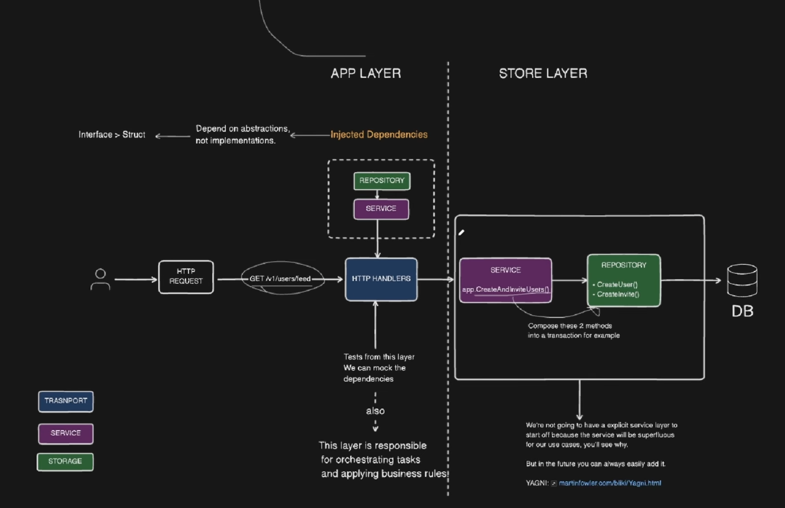

#  Complete Backend Engineering Course in Go
```
source : https://youtu.be/h3fqD6IprIA?si=mM7ftkpqU8OYoLeA
```
---

## The `net/http` Package

> **`net/http`** adalah standard library bawaan Go untuk membangun HTTP client dan HTTP server secara native tanpa framework

---

```Go
package main

import (
	"log"
	"net/http"
)

type server struct {
	addres string
}

// test: curl http://localhost:8080
// server akan membalas "Hello world" ke semua request
func (sv *server) ServeHTTP(w http.ResponseWriter, r *http.Request) {
	w.Write([]byte("Hello world"))
}

func main() {
	s := &server{addres: ":8080"}
	if err := http.ListenAndServe(s.addres, s); err != nil {
		log.Fatal(err)
	}
}
```

---

### Flow Request → Response

```
curl http://localhost:8080/apa-aja
        │
        ▼
  http.ListenAndServe(":8080", server)
        │
        ▼
  server.ServeHTTP(w, r)
        │
        ▼
  w.Write([]byte("Hello world"))
        │
        ▼
  client terima: "Hello world"
```
---
### Claude - Gimana Cara Server Kirim Data ke Client?

**1. HTTP itu pada dasarnya Cuma "Ngirim Surat"**

Client (browser / curl) dan server itu kayak dua orang yang cuma bisa komunikasi lewat surat. 

**2. Client Kirim Surat (HTTP Request)**

```
┌─────────────────────────────────────────┐
│  Dari: browser (192.168.1.5)            │
│  Ke:   server (localhost:8080)          │
│                                          │
│  GET /hello HTTP/1.1                     │
│  Host: localhost:8080                    │
│                                          │
│  (body kosong)                           │
└─────────────────────────────────────────┘
```

Client nulis surat. Isinya: "Aku mau minta halaman `/hello`". Surat ini dikirim lewat **TCP connection** — ibarat tukang pos yang nganterin surat lewat jalur yang udah dibuka dari rumah client ke rumah server.

**3. Server Terima Surat — `http.ListenAndServe`**

```
   surat masuk ──► http.ListenAndServe
                         │
                         │  "Ada surat nih, baca..."
                         │
                         ▼
                  pecah jadi 2 benda
                  ┌────────┐  ┌──────────┐
                  │   w    │  │    r     │
                  │ Writer │  │ Request  │
                  └────────┘  └──────────┘
```

`http.ListenAndServe` ibarat **penjaga pintu** rumah server. Dia:
- Nunggu di depan pintu (port 8080) 24/7
- Begitu ada surat datang, dia buka amplopnya
- Amplopnya dipecah jadi dua:
  - **r (Request)** — isi surat dari client (dari siapa, minta apa, lewat mana)
  - **w (ResponseWriter)** — kertas kosong buat balesan

Terus dia manggil kamu: "Heh, ini ada surat. `r` isi suratnya, `w` kertas kosong buat bales."

**4. Kamu (ServeHTTP) Nulis Balasan**

```go
func (sv *server) ServeHTTP(w http.ResponseWriter, r *http.Request) {
    w.Write([]byte("Hello world"))
}
```

Kamu sebagai `ServeHTTP` itu ibarat **orang yang ditugasin bales surat**. Kamu dikasih:
- **r**: surat dari client (boleh dibaca, boleh diabaikan)
- **w**: kertas kosong

Lalu kamu nulis di kertas kosong itu:

```
┌─────────────────────────────────────────┐
│  Dari: server (localhost:8080)          │
│  Ke:   client                           │
│                                          │
│  HTTP/1.1 200 OK                         │
│  Content-Length: 11                      │
│                                          │
│  Hello world                             │
└─────────────────────────────────────────┘
```

`w.Write` itu **kamu megang pulpen, nulis langsung di kertas balasan**. Ga pake perantara.

**5. Balik ke Client**

```
   w.Write selesai ──► http.ListenAndServe
                              │
                              │  "Balasan udah siap, kirim!"
                              │
                              ▼
                         Tukang pos (TCP)
                         anter balik surat
                              │
                              ▼
                         Client terima:
                         "Hello world"
```

Begitu kamu selesai nulis di `w`, server langsung nyuruh TCP anter balik surat ke client. Client buka amplop, baca: "Hello world".

**Flow Lengkap**

```
Browser (client)                              Server Go
    │                                              │
    │  "GET /" ──────── TCP Connection ──────────► │
    │                                              │
    │                                    ListenAndServe
    │                                    terima surat
    │                                    pecah jadi r & w
    │                                          │
    │                                    ServeHTTP(w, r)
    │                                          │
    │                                   w.Write("Hello world")
    │                                          │
    │  "Hello world" ◄──── TCP Connection ──────┘
    │                                              │
    ▼                                              ▼
  tampil di browser                        balik nunggu request
```

<!-- claude generated end -->

---
### Native Way to Handle HTTP Request

```Go
package main

import (
	"log"
	"net/http"
	"fmt"
)

type server struct {
	addres string
}

// pada contoh dibawah kita gunakan arsitektur simple
// mapping routing methode then resource
// namun pada best practice nya better resource then methode karena 
// resource itu benda utama. method cuma operasi atas benda itu. jadi natural-nya: tentuin dulu benda mana, baru tentuin operasinya.
func (sv *server) ServeHTTP (w http.ResponseWriter, r *http.Request){
	switch r.Method {
	// bisa "GET" tapi hardcoded string is not good, use http.MethodGet instead
	case http.MethodGet:
		switch r.URL.Path {
		case "/":
			// write merupakan native way to send messg ke client
			// dimana emang langsung dikirim byte nya seperti itu dan client menerima apa adanya
			// why not fmt?, bisa pakai fmt tapi tetap fmt yang nerima Response writer untuk nulis reponse nya
			w.Write([]byte("index ni"))

			// set return biar ga bablas, bablas disini misal kita ada case lanjutan setelah keluar dari swtich
			return

		case "/users":
			// contoh pake fmt
			fmt.Fprint(w, "users data ni")
			return

		default:
			// tidak ada Get dengan resource ini
			w.Write([]byte("404 resource not found"))
			return
		}

	default:
		// tidak ada methode ini
		w.Write([]byte("404 methode not found"))
		return
	}
}

func main() {
	s := &server{addres: ":8080"}
	if err := http.ListenAndServe(s.addres, s); err != nil {
		log.Fatal(err)
	}
}

// to test
// curl http://localhost:8080/ 				-> index
// curl http://localhost:8080/users 		-> users
// curl http://localhost:8080/random		-> 404 resource not found
// curl -X POST http://localhost:8080/users -> 404 methode not found
```
---
### One Abstraction using `http.HandlerFunc` and `http.ServeMux`
>ServeMux (Service Multiplexer) adalah HTTP router bawaan Go. Fungsinya: nentuin handler mana yang jalan berdasarkan path dan method dari request yang masuk. Singkatnya: request multiplexer.

```
Manual (satu handler, switch-case):

                     ┌──────────────┐
  semua request ──►  │  ServeHTTP    │
  GET /              │              │
  GET /users         │  switch path │
  POST /users        │  switch meth │
  GET /random        │  semua disini│
                     └──────────────┘
                           │
                    satu function nangani semuanya

ServeMux (router + banyak handler):

                     ┌──────────────┐
  GET / ──────────►  │              │──► indexHandler
  GET /users ──────► │  ServeMux    │──► usersHandler
  POST /users ─────► │  (router)    │──► usersHandler (jalan juga kalo POST)
  GET /random ─────► │              │──► 404 (default, otomatis)
                     └──────────────┘
                           │
                    mux milihin handler
```
---
```Go
package main

import (
	"net/http"
	"log"
)

type api struct {
	addres string
}

// func (sv *api) ServeHTTP (w http.ResponseWriter, r *http.Request){
// 	w.Write([]byte("Hello Wolrld"))
// }

// sekarang Api (prev;server) bertindak bukan sebagai routing 
// atau harus implement ServeHTTP tapi penyedia methode untuk handler saja
func (a *api) getUsersHandler(w http.ResponseWriter, r *http.Request){
	w.Write([]byte("nih list of users"))
}

func (a *api) createUserHandler(w http.ResponseWriter, r *http.Request){
	w.Write([]byte("user dibuat ! :>"))
}

func main() {
	api := &api{addres: ":8080"}

	// init servemux
	// mux sudah implement ServeHTTP sehingga dia valid jadi http.handler
	// nah karena itu kita tidak perlu membuat api sebagai http.handler
	// tpi kita bisa borrow function / methode si api buat digunakan ServeMux 
	// untuk handle incoming request
	mux := http.NewServeMux()

	srv := &http.Server{
		Addr: api.addres,
		Handler: mux,
		// dengan menggunakan http server bisa set berbagai config
	}

	// disini mux bertindak sebagai routing yang kita bisa register methode seta resource nya
	// untuk menuju ke handler yang ditentukan 

	mux.HandleFunc("GET /users", api.getUsersHandler)
	mux.HandleFunc("POST /users", api.createUserHandler)

	if err := srv.ListenAndServe(); err != nil {
		log.Fatal(err)
	}

}

// to test
// curl -X POST http://localhost:8080/users	
// curl http://localhost:8080/users
```

---

## Encoding and Decoding JSON
> fungsinya untuk mengubah data dari struct ke JSON (encoding) dan dari JSON ke struct (decoding)

```Go
package main

import (
	"encoding/json"
	"errors"
	"log"
	"net/http"
)

type user struct {
	Name string `json:"name"` // fungsi json tag yaitu : auto marshal and marshaling buat encode decode
	Age int		`json:"age"`
}

type api struct {
	addres string
}

func beforeInsertUser(u user) error {
	// user validation sebelum dimasukan ke slice
	if (u.Name) == "" {
		return errors.New("Nama tidak boleh kosong")
	}
	if (u.Age) < 0 {
		return errors.New("Umur tidak bisa negatif")
	}
	if (u.Age) > 100 {
		return errors.New("Yang benar saja")
	}

	// tidak boleh ada user yang sama
	for _, user := range users{
		if u.Name == user.Name && u.Age == user.Age {
			return  errors.New("User sudah ada !")
		}
	}
	return nil 
}

var users = []user{}

func (a *api) getUsersHandler(w http.ResponseWriter, r *http.Request){
	// menuliskan header ke rsponse writter
	w.Header().Set("Content-Type", "application/json")

	/* 
	content-type : application/json artinya ngasi tau ke client
	"body dari response ini adalah json, jadi tolong di parse"
	tanpa ini, client bisa nggap response nya itu plain text ato malah html dan
	bakal bikin error / bug jika frontend nyoba buat make response.json() parsing
	*/

	// encode users slice to json
	// json.NewEncoder(w) akan otomatis encode ke json dan write ke response writer
	// encode itu apa ? jadi encode itu proses convert data ke format lain, misal dari struct ke json ato dari json ke struct
	// dalam hal ini kita convert dari struct user ke json, jadi nanti response nya bisa di parse di frontend ato postman
	err := json.NewEncoder(w).Encode(users)
	if err != nil {
		http.Error(w, err.Error(), http.StatusInternalServerError)
		return
	}

	w.WriteHeader(http.StatusOK)

}

func (a *api) createUserHandler(w http.ResponseWriter, r *http.Request){
	// decode request body to user struct
	// payload user ini adalah data yang dikirim dari client, misal dari postman ato frontend
	var payload user

	// decorder nya akan take request body dan decode ke struct user
	// decode disini akan otomatis mapping field dari json ke struct user, misal json name -> struct name
	// makanya perlu payload sebagai struct user, biar bisa di mapping ke struct user
	// jika ada error, misal json nya invalid ato field nya ga sesuai, maka akan return error
	if err := json.NewDecoder(r.Body).Decode(&payload); err != nil {
		http.Error(w, err.Error(), http.StatusBadRequest)
		return
	}

	// hasil dari decode payload akan di append ke slice users, jadi nanti bisa di get semua user nya
	u := user{
		Name: payload.Name,
		Age: payload.Age,
	}

	// disini bisa kita masukan validation atau fungsi lain untuk memvalidasi input
	if err := beforeInsertUser(u); err != nil {
		http.Error(w, err.Error(), http.StatusBadRequest)
		return
	}

	users = append(users, u)
	w.WriteHeader(http.StatusCreated)

}

func main() {
	api := &api{addres: ":8080"}

	mux := http.NewServeMux()

	srv := &http.Server{
		Addr: api.addres,
		Handler: mux,
	}

	mux.HandleFunc("GET /users", api.getUsersHandler)
	mux.HandleFunc("POST /users", api.createUserHandler)

	if err := srv.ListenAndServe(); err != nil {
		log.Fatal(err)
	}

}
// To Test : 
/*
curl -X POST -v 'http://localhost:8080/users' \
  -H 'accept: application/json' \
  -H 'Content-Type: application/json' \
  -d '{"name" : "nandra", "age" : 21}'
*/

// curl http://localhost:8080/users
```

---

## Setting up development
```
Go 1.22<=
Docker
Postgres on Docker
Swagger for docs
Golang migrate for migrations
```

### Folder Structure
> membagi busniess logic dan routing handler agar lebih clean dan maintainable
```
├── bin
├── cmd
│   ├── api
│   └── migrate
│       └── migrations
├── docs
├── internal
└── scripts
```

1. **Separation of concern** : Tiap level pada program harus di pisahkan dengan barrier yang clear, transport layer, service layer, storage layer
2. **Dependency Inversion Principle (DIP)** : Kamu menginject dependency ke layer mu, bukan langsung memanggilnya agar membuat loose coupling dan memudahkan testing
3. **Adaptability to change** : dengan mengorganisasi kode kita secara modular kita bisa dengan mudah menambah fitur, refactor kode, atau merespon terhadap perubahan rbusiness requirment dengan lebih mudah. Sistem harus dirancang supaya dapat dengan mudah dirubah tanpa mengganggu bagian lain dari kode
4. **Focus on Busineess Value** : focus on adding or delivering value to user as they are the one responsible for paying your bills. 

### Layers
> Pada struktur ini kita akan membagi ke tiga layer yaitu Transport, Service dan Storage, namun kita bisa nge ommit service karena hanya simple nanti
1. Transport layer : bagaimana cara kita deliver message to user, misal sekarang HTTP
2. Service Layer : business logic, misal kita mau bikin user baru, maka service layer yang akan handle logic nya
3. Storage Layer : bagaimana cara kita menyimpan data, misal kita mau simpan user, abstraksi antara service layer dengan misal database

> Injection 
```
Repository -> Service -> Transport
```



---

## Setting up HTTP Server
> Using `chi` as router, `middleware` for logging, request id, recoverer and timeout


```Go
package main

import (
	"log"
	"net/http"
	"time"

	"github.com/go-chi/chi/v5"
	"github.com/go-chi/chi/v5/middleware"
)

type application struct {
	config config
}

type config struct {
	addr string
}

func (app *application) mount() http.Handler {

	r := chi.NewRouter()

	// digunakan untuk generate request id untuk setiap request yang masuk ke server
	r.Use(middleware.RequestID)

	// ngelog setiap req yang masuk ke server
	// jadi -> log nya akan seperti 
	// 2026/07/26 19:31:48 "GET http://localhost:8080/v1/ HTTP/1.1" from [::1]:62206 - 200 19B in 157.709µs
	// digunakan untuk debugging misal error ketika hit endpoint tertentu, bisa dilihat dari log nya
	r.Use(middleware.Logger)

	// middleware.Recoverer digunakan untuk menangkap panic yang terjadi di handler
	// misal kita bikin handler yang sengaja panic, maka middleware ini akan menangkapnya dan mengembalikan 500 internal server error
	// jadi server tidak akan crash dan tetap berjalan
	r.Use(middleware.Recoverer)


	// timeout value on request context (ctx), that will signal
	// through ctx.Done() that the request has timed out and further
	// processing should be stopped
	r.Use(middleware.Timeout(time.Second * 60))
	
	// // inline routing
	// // nameless func
	// r.Get("/", func(w http.ResponseWriter, r *http.Request){
	// 	w.Write([]byte("Hello this from / !"))
	// })

	// // pass to handfunc
	// r.Get("/health", app.healthCheckHandler)

	// below using group or route in chi
	// curl http://localhost:8080/v1/
	// curl http://localhost:8080/v1/health
	r.Route("/v1", func(r chi.Router){
		r.Get("/", func(w http.ResponseWriter, r *http.Request){w.Write([]byte("Hello this from / !"))})
		r.Get("/health", app.healthCheckHandler)
		// assigning new handler doesnt need comma because 
		// Go separates statements by line breaks, not commas.
	})

	return  r

}

// Note : we can change entire *chi.Mux to http.Handler with the power of interface
// dimana si chi mux ini sendiri mengimplementasikan http.handler sehingga bisa diganti langsung ke http.handler
// and result -> we dont really need chimux and can provide our own router if want to
func (app *application) run(mux http.Handler) error{

	srv := http.Server{
		Addr: app.config.addr,
		Handler: mux,
		WriteTimeout: time.Second * 30,
		ReadTimeout: time.Second * 10,
		IdleTimeout: time.Minute ,
	}

	log.Printf("server started at : %s", app.config.addr)

	return srv.ListenAndServe()
}
```
---
## Hot reloading setup
> will be using air for auto reload

> what is air ?
air is a live reloading tool for Go applications. 
It watches for file changes in your project and automatically rebuilds and restarts your application, making development faster and more efficient.

> How to install Air ?
```
go install github.com/air-verse/air@latest
```

> How to initialize air ?

init
```
air init 
```

Setelah init air bisa fokus ke configurasi :
```
# .air.toml
1. exclude_dir
2. exclude_file
3. bin - path
4. everything with temp change to bin
```

Run with
```
air 
```

--- 

## Environment Variables
> env var adalah variable yang digunakan untuk menyimpan konfigurasi aplikasi yang bisa diubah tanpa harus mengubah kode sumber. 
Biasanya digunakan untuk menyimpan informasi sensitif seperti API keys, database credentials, atau konfigurasi yang berbeda antara lingkungan development, staging, dan production.

contoh penerapan membuat ambil env var di Go :
```Go
package env

// bisa pake library env eksternal, tapi ini cara ngelakuin manual

import (
	"os"
	"strconv"
)

// Get string value enviroment variable dari native golang
func GetString(key, fallback string) string {
	val, ok := os.LookupEnv(key)
	if !ok {
		return fallback
	}
	return val
}

// Get Int value enviroment variable
func GetInt(key string, fallback int) int {
	val, ok := os.LookupEnv(key)
	if !ok {
		return  fallback
	}

	valAsInt, err := strconv.Atoi(val)
	if err != nil {
		return fallback
	}

	return valAsInt
}
```

### .envrc
Now how to read from .env file ? we will not be using godotenv but using .envrc
what is it ? is a way to set env var in shell session via .envrc file. It is part of the direnv tool, which automatically loads and unloads environment variables based on the current directory.

> we will be using direnv to load env var from .envrc file.

How to install direnv ?
```
brew install direnv
```

How to setup direnv ?
```
add direnv hook bash/zsh/fish to your shell configuration file (e.g., .bashrc, .zshrc, or .config/fish/config.fish)

zsh
echo 'eval "$(direnv hook zsh)"' >> ~/.zshrc
```
```
direnv allow .
```
> above will allow direnv to load env var from .envrc file in current directory.

>! direnv will ask for permission everytime it changes so be sure to run `direnv allow` after editing .envrc file.

---

## Repository Pattern 
> connect to database, abstract away etc
worse code : where business logic is coupled with database logic, making it hard to test and maintain.

### Claude : Context: Kenapa Dioper-oper Terus?

**1. Apa itu `context.Context`?**

`context.Context` adalah amplop yang nempel di setiap request. Isinya tiga hal yang ngikut dari layer terluar (HTTP handler) sampai ke layer paling dalam (database call):

```
┌──────────────────────────────────────────────┐
│  context.Context                              │
│                                               │
│  Deadline     : request ini expired jam       │
│                 10:00:03, jangan proses lagi  │
│  Cancellation : client udah nutup koneksi,   │
│                 stop semua kerjaan!           │
│  Values       : request ID, user info,        │
│                 tracing data                  │
└──────────────────────────────────────────────┘
```

`context.Context` itu **interface** dengan 4 method:
- `Deadline()` : kapan context ini expired (waktu absolut)
- `Done()` : return channel yang ke-close saat context di-cancel atau expired
- `Err()` : kenapa context selesai? `nil` kalau masih hidup, `context.Canceled` kalau di-cancel manual, `context.DeadlineExceeded` kalau timeout
- `Value(key)` : ambil data yang diselipin middleware

Semua operasi I/O di Go (database, HTTP client, gRPC) nerima `context.Context` sebagai parameter pertama.

**2. Kenapa Parameter Pertama dan Bukan Ditaruh di Struct?**

```go
// ❌  BAD: context di struct
type PostsStore struct {
    db  *sql.DB
    ctx context.Context  // jangan begini!
}

// ✅ GOOD: context sebagai parameter pertama (idiomatic Go)
func (s *PostsStore) Create(ctx context.Context, post *Post) error { ... }
```

Alasan context jangan disimpen di struct:
- Satu request = satu context. Kalau disimpen di struct, context-nya kepake buat semua request (bahaya: context pertama udah expired, request kedua ikut ke-cancel)
- Context itu request-scoped, bukan object-scoped. Store hidup lama (seumur aplikasi), context hidup pendek (seumur request)
- Explicit > implicit. Begitu liat parameter pertama `ctx`, kamu langsung tahu fungsi ini jalan di dalam sebuah request

Perbandingan sama framework lain: Django/Spring nyimpen context di thread-local (ga kelihatan di function signature). Di Go, context selalu eksplisit sebagai parameter.

**3. Gimana Context Mengalir: Dari Request Sampai Database**

```
HTTP Request masuk (bareng context dari Go stdlib)
        │
        ▼
┌───────────────────────────────────────────────────┐
│  chi.Router + Middleware                           │
│                                                    │
│  middleware.Timeout    -> inject deadline 60s      │
│  middleware.RequestID  -> inject requestID value   │
│  middleware.Logger     -> baca values buat log     │
│                                                    │
│  Semua middleware nerima & lempar context          │
│  lewat r.WithContext(ctx) supaya context makin     │
│  kaya nilai-nya seiring jalan ke handler           │
└──────────────────────┬────────────────────────────┘
                       │
                       ▼
┌───────────────────────────────────────────────────┐
│  Transport Layer (Handler)                        │
│                                                    │
│  func (app *application) createPostHandler(       │
│      w http.ResponseWriter,                        │
│      r *http.Request,                              │
│  ) {                                               │
│      ctx := r.Context()                            │
│                                                    │
│      var post Post                                 │
│      json.NewDecoder(r.Body).Decode(&post)         │
│      //            ▲                                │
│      // r.Body cuma dipake disini,                 │
│      // ga ikut turun ke store!                    │
│                                                    │
│      app.store.Posts.Create(ctx, &post) ──────────┐│
│  }                                                 ││
└────────────────────────────────────────────────────┘│
                       │                              │
                       ▼                              │
┌───────────────────────────────────────────────────┐ │
│  Storage Layer (Repository)                       │ │
│                                                    │ │
│  func (s *PostsStore) Create(                     │◄┘
│      ctx context.Context,                          │
│      post *Post,                                   │
│  ) error {                                        │
│      // Store ga peduli request dari HTTP,         │
│      // gRPC, CLI, atau background worker.        │
│      // Dia cuma peduli: "ini context, ini data"  │
│      return s.db.QueryRowContext(                 │
│          ctx,                                      │
│          `INSERT INTO posts (title, content)       │
│           VALUES ($1, $2) RETURNING id`,           │
│          post.Title, post.Content,                 │
│      ).Scan(&post.ID)                             │
│  }                                                 │
└────────────────────────────────────────────────────┘
```

**Ini kuncinya**: Handler adalah **batas antara dunia HTTP dan dunia bisnis**. Semua data HTTP (header, body, params) diekstrak di handler. Yang turun ke store cuma context + data bisnis yang udah bersih. Store nggak tahu dan nggak boleh tahu soal HTTP.

**4. Kenapa Bukan `gin.Context` atau `*http.Request` yang Dioper ke Bawah?**

```
❌  func (s *PostsStore) Create(c *gin.Context, post *Post) error
    Akibat:
    - Store coupled ke Gin. Gabisa dipake di gRPC / CLI / worker
    - Testing harus bikin gin.Context dulu (ribet, perlu setup Gin engine)
    - Import cycle risk: store import Gin, Gin handler import store

✅  func (s *PostsStore) Create(ctx context.Context, post *Post) error
    Akibat:
    - Store cuma bergantung ke standard library
    - Testing tinggal ctx := context.Background()
    - Bisa dipake dari transport layer apapun
```

Kalau kamu pake Gin: tetep ekstrak `c.Request.Context()` buat dikirim ke store. `gin.Context` cuma dipake di handler layer, yaitu buat akses `c.Query()`, `c.Param()`, `c.JSON()`, dsb. Jangan pernah lempar `gin.Context` bulat-bulat ke bawah.

Yang bikin bingung: `gin.Context` **embed** `context.Context` (via `c.Request.Context()`), jadi secara teknis `gin.Context` juga implement interface `context.Context`. Tapi tetep jangan dikirim ke store karena dia bawa baggage HTTP yang nggak relevan.

**5. Context Values: Nyelipin Data Tambahan**

Middleware nyuntik nilai ke context, handler/store ambil lagi:

```go
// Middleware nyuntik request ID
func RequestIDMiddleware(next http.Handler) http.Handler {
    return http.HandlerFunc(func(w http.ResponseWriter, r *http.Request) {
        ctx := context.WithValue(r.Context(), "requestID", uuid.New().String())
        next.ServeHTTP(w, r.WithContext(ctx))
        // r.WithContext(ctx) bikin *http.Request baru dengan context yang diperkaya
        // (context immutable: WithValue nggak ngubah context lama, dia bikin turunan baru)
    })
}

// Di store, ambil buat logging
func (s *PostsStore) Create(ctx context.Context, post *Post) error {
    reqID, _ := ctx.Value("requestID").(string)
    log.Printf("[%s] inserting post: %s", reqID, post.Title)
    return s.db.QueryRowContext(ctx, "INSERT INTO posts ...").Scan(&post.ID)
}
```

Context Values sebaiknya cuma dipake buat **cross-cutting concerns** (request ID, tracing, auth token), jangan buat ngoper **business data**. Kalau kamu butuh ngirim data bisnis ke store, jadikan parameter eksplisit.

**6. Cancellation & Timeout: Jangan Buang-buang Resource**

Ini use case paling penting dari context. Begitu context di-cancel (client nutup browser, timeout middleware, atau kamu cancel manual), semua operasi yang pake context itu harus berhenti.

```
waktu ──────────────────────────────────────────────────────────►

Client ──POST /posts──► Server ──INSERT INTO posts──► Database
  │                        │                            │
  │                        │                     (query jalan...
  │                        │                      butuh 3 detik)
  │                        │                            │
  │   (user nutup tab)     │                            │
  │── TCP close ──────────►│                            │
  │                        │                            │
  │                   ctx.Done()                        │
  │                   channel ke-close                  │
  │                        │                            │
  │                   QueryRowContext                   │
  │                   batalin query ───────────────────►│
  │                        │                            │
  │                        │◄── canceled, conn freed ───│
  │                        │
  │              DB connection balik ke pool
  │              CPU nggak ngerjain kerjaan sia-sia
```

```go
func (s *PostsStore) Create(ctx context.Context, post *Post) error {
    err := s.db.QueryRowContext(ctx,
        "INSERT INTO posts (title, content) VALUES ($1, $2) RETURNING id",
        post.Title, post.Content,
    ).Scan(&post.ID)

    if err != nil {
        // Cek kenapa gagal
        switch {
        case errors.Is(err, context.Canceled):
            // client nutup koneksi, bukan salah kita
            return err
        case errors.Is(err, context.DeadlineExceeded):
            // query kelamaan, mungkin perlu di-optimize
            return err
        default:
            return err
        }
    }
    return nil
}
```

**Cara bikin context dengan timeout sendiri:**

```go
// Level seluruh request (dari middleware)
r.Use(middleware.Timeout(60 * time.Second))

// Level operasi spesifik (di store)
func (s *PostsStore) HeavyQuery(ctx context.Context) error {
    ctx, cancel := context.WithTimeout(ctx, 5*time.Second)
    defer cancel()  // PENTING: selalu defer cancel, meskipun operasi sukses
    // kalau nggak di-defer, context bocor (goroutine + timer nggak dibersihin)

    return s.db.QueryRowContext(ctx, "SELECT pg_sleep(10)").Scan()
    // gagal setelah 5 detik: context.DeadlineExceeded
}
```

Kenapa `defer cancel()` wajib meskipun sukses? `context.WithTimeout` bikin goroutine internal buat timer. Kalau `cancel` nggak dipanggil, goroutine + timer itu tetap hidup sampe timeout beneran terjadi (5 detik kemudian). Buat operasi yang cepet selesai (10ms), itu 5 detik resource kebuang.

**7. Context Tree: Parent dan Child**

Context itu kayak pohon keluarga. Cancel parent, semua child ikut ke-cancel:

```
context.Background()                    akar, nggak pernah expire
    │
    └── r.Context()                     dari net/http, hidup = seumur request
            │
            ├── context.WithTimeout()   buat operasi spesifik (5 detik)
            ├── context.WithValue()     buat nyelipin request ID
            └── context.WithCancel()    buat operasi yang bisa di-cancel manual
```

Jika request context di-cancel (timeout 60s middleware), semua turunannya ikut ke-cancel. Tapi kalau child timeout 5s ke-trigger lebih dulu, child-nya aja yang cancel, parent tetap hidup (request masih bisa ngerjain hal lain).

**8. Testing Jadi Gampang**

```go
func TestCreatePost(t *testing.T) {
    store := &PostsStore{db: testDB}

    // Cuma perlu ini, ga perlu spin up HTTP server
    ctx := context.Background()

    err := store.Create(ctx, &Post{Title: "test", Content: "hello"})
    assert.NoError(t, err)
}
```

Bandingin kalau store nerima `gin.Context`: harus bikin Gin engine, bikin request palsu, setup router. Dengan `context.Context`, testing cukup `context.Background()`.

Untuk test yang perlu timeout/cancellation:
```go
func TestCreatePostTimeout(t *testing.T) {
    ctx, cancel := context.WithTimeout(context.Background(), 1*time.Millisecond)
    defer cancel()

    store := &PostsStore{db: testDB}
    err := store.Create(ctx, &Post{Title: "test"})

    assert.ErrorIs(t, err, context.DeadlineExceeded)
}
```

**9. Kapan Function Perlu Parameter Context?**

```
┌─────────────────────────────────────────────────────┐
│  PERLU ctx jika:                                     │
│  - I/O operations (database, HTTP call, file)        │
│  - Long-running computation yang bisa di-cancel      │
│  - Memanggil function lain yang butuh context        │
│  - Intinya: kalau function ada di path request,      │
│    context harus jadi param pertama                   │
│                                                       │
│  TIDAK PERLU ctx jika:                                │
│  - Pure computation / transformation (ga ada I/O)    │
│  - Simple helper / utility functions                  │
└─────────────────────────────────────────────────────┘
```

**Rangkuman Flow Context Dari Atas Sampai Bawah**

```
net/http bikin context dari request masuk
    │
    ▼
middleware perkaya context (deadline, request ID, dll)
    │
    ▼
handler ekstrak payload HTTP, ambil ctx := r.Context()
handler panggil store.Create(ctx, dataBisnis)
    │
    ▼
store.Create(ctx, post)
    ├── ctx dipake buat QueryRowContext (database)
    ├── ctx.Value("requestID") buat logging
    └── ctx.Done() otomatis cancel query kalau client timeout/cabut
    │
    ▼
semua layer pakai context yang sama
nggak ada yang tahu request dari HTTP, gRPC, atau CLI
yang mereka tahu: deadline, cancellation, values
```

## Presistent Data with SQL Database

```Go
package store

import (
	"context"
	"database/sql"

	"github.com/lib/pq"
)

// post merepresentasikan satu baris di tabel posts (model data / struct tag)
// struct tag `json:"..."` dipakai saat struct ini diserialize ke json response
type Post struct {
	ID       int64    `json:"id"`
	Content  string   `json:"content"`
	Title    string   `json:"title"`
	UserID   int64    `json:"user_id"`
	Tags     []string `json:"tags"`
	CreateAt string   `json:"created_at"` 
	UpdateAt string   `json:"updated_at"`
}

// postsstore membungkus koneksi *sql.db untuk operasi crud di tabel posts
// pattern ini disebut repository / data access layer
type PostStore struct {
	db *sql.DB
}

// create menjalankan insert ke tabel posts, lalu memindai balik id, created_at, dan updated_at
// menggunakan returning agar tidak perlu select lagi setelah insert
// post dikirim sebagai pointer karena method ini akan mengisi field id, created_at, updated_at
func (s *PostStore) Create(ctx context.Context, post *Post) error {
	// $1..$4 adalah placeholder postgres (parameterized query) untuk mencegah sql injection
	// berbeda dengan mysql yang pakai ?
	query := `
		INSERT INTO posts (content, title, user_id, tags)
		VALUES ($1, $2, $3, $4) RETURNING id, created_at, updated_at
	`

	// queryrowcontext dipakai karena query hanya mengembalikan 1 baris
	// ctx memungkinkan query dibatalkan kalau request http sudah timeout atau client disconnect
	err := s.db.QueryRowContext(
		ctx,
		query,
		post.Content,
		post.Title,
		post.UserID,
		pq.Array(post.Tags), // pq.array mengkonversi []string go ke format postgres array {val1,val2}
	).Scan(
		&post.ID,       // scan menulis nilai dari returning ke field struct (pakai pointer)
		&post.CreateAt,
		&post.UpdateAt,
	)
	if err != nil {
		return err // error dikembalikan ke caller (handler), bukan dipanic
	}
	return nil
}
```
---
## DB Connection

```Go
package db

import (
	"context"
	"database/sql"
	"time"
)

func New(dsn string, maxOpenConns, MaxIdleConns int, maxIdleTime string) (*sql.DB, error) {
	db, err := sql.Open("postgres", dsn)
	if err != nil {
		return nil, err
	}

	db.SetMaxOpenConns(maxOpenConns)
	db.SetMaxIdleConns(MaxIdleConns)

	duration, err := time.ParseDuration(maxIdleTime)
	if err != nil {
		return nil, err
	}
	
	db.SetConnMaxIdleTime(duration)

	// if it takes more than 5 second to connect then timeout
	ctx, cancel := context.WithTimeout(context.Background(), 5*time.Second)
	defer cancel()

	if err = db.PingContext(ctx); err != nil {
		return nil, err
	}

	return db, nil
}
```

```Go
cfg := config{
		addr: env.GetString("ADDR", ":8080"),
		db: dbConfig{
			dsn: env.GetString("DB_DSN", "host=localhost port=5432 user=admin password=adminpassword dbname=social sslmode=disable"),
			maxOpenConns: env.GetInt("DB_MAX_OPEN_CONNS", 30), // higher number = higher concurent query (atleast what i understand)
			maxIdleConns: env.GetInt("DB_MAX_IDLE_CONNS", 30), // number of open connection in connection pool
			maxIdleTime: env.GetString("DB_MAX_IDLE_TIME", "15m"),
		},
	}

	db, err := db.New(cfg.db.dsn, 
		cfg.db.maxOpenConns, 
		cfg.db.maxIdleConns, 
		cfg.db.maxIdleTime)
	if err != nil {
		log.Fatal(err)
	}

	defer db.Close()
	log.Println("database conn established")
```

```dockerfile
services:
  db:
    image: postgres:16-alpine
    container_name: social-db
    environment:
      POSTGRES_USER: admin
      POSTGRES_PASSWORD: adminpassword
      POSTGRES_DB: social
    volumes:
      - pgdata:/var/lib/postgresql/data
    ports:
      - "5432:5432"

volumes:
  pgdata:

```